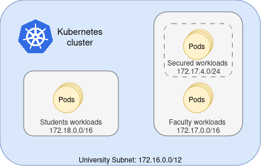
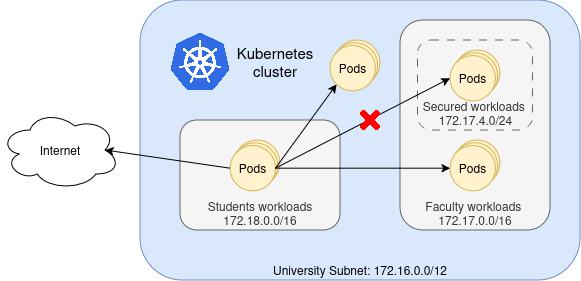

# NetworkPoliciesExample
Examples of possible network policies that can be setup using EngineBPF in a kubernetes cluster.

In the example, we have a kubernetes cluster with multiple ip pools, set by namespaces. A sample scenario is shown for a use case where a university is controlling a kubernetes cluster with multiple microservices, and Computer science students can deploy their laboratories and use universities available services, as seen in this figure:

 Depending on configuration, the institution may desire to enable students pods and containers with the faculty or not. [Policy1](policy1.yaml) is an example where students have access to the internet and almost all the cluster but not the secured workload. (policy1.yaml)

 Also it is possible to set students to only communicate with faculty workloads, skipping the secured, and other services the university may provide, as shown in [policy 2.](policy2.yaml)
 
